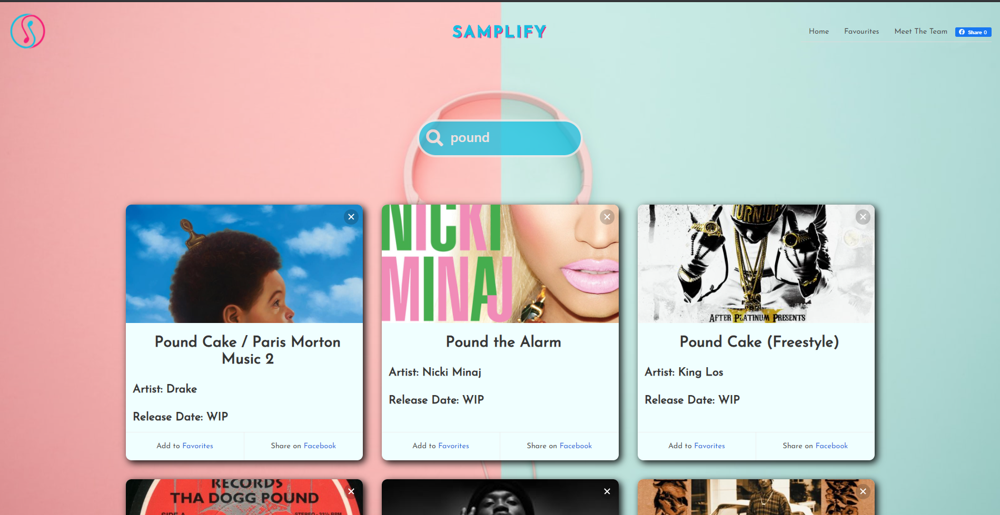

# Samplify

[Deployed GitHub Pages Site](https://leon3005.github.io/samplify-uk/)

## Motivation

Have you ever been listening to one of your favourite songs and noticed a short snippet of a song that you recognised, but couldn't quite put your finger on what it was? This is where Samplify comes in. Samplify allows you to search for any song and find samples of other songs that were used by the producer (if available/samples were used) with playable YouTube links.

## How do I use Samplify?

To get started, simply click on the search bar and start to search for your favourite song by pressing 'Enter'. You then need to click on the artwork of that song to see the results.

No sample found? Sadly, not all songs make use of samples, but you should instead be presented with a preview of that song via Apple Music.

You can test some samples by clicking on of the randomly generated songs on the home page!

## Screenshots

**Landing page:**

The landing page features a slider on the bottom of the page that allows you to select the artwork to see the sample, a search bar to find any requested songs, the Samplify logo, and a nav bar that allows you to see your favourited songs.

**Search Results:**

When searching for a song, you are presented with the top 6 matches from Genius. Here, you can click on the artwork to view the samples or use the 'Add to favorites' button. You can also click the 'X' to delete the card from the page. If all cards are deleted, you are presented with the original slider.

## Tech/framework used

<b>Built with</b>

- [Bulma](https://bulma.io/)
- [jQuery](https://jquery.com/)

## Features

## Code Example

## API's

For this project we used the Genius API and the Youtube API.

Documentation for both of these can be found below:

- [Genius](https://docs.genius.com/)
- [Youtube](https://developers.google.com/youtube/v3)

The Genius API, via Rapid API, was used as a catalog for when the user searches for a song. It will search for all results on Genius and can help be specified by adding the artist at the end of the song. We then display the song artwork, title, and artist in a card using Bulma. We also applied data attributes to the divs to use when fetching the sample. One of these core attributes is the song ID, as we need to use the Genius API again but this time with the song ID to get more details for the song, including the sample.

When the artwork is clicked, the next Genius fetch function will be called that will get again the artwork, title, artist, release date, and list of samples in that song. If the samples object is entry, a modal will pop up. If samples are available, we then got the sample objects and put them inside of the Youtube API fetch function. Here, we searched Youtube for the top result depending on the sample name and created a div with an embedded player for that song. We used a forEach in case there were multiple samples.

## Tests
